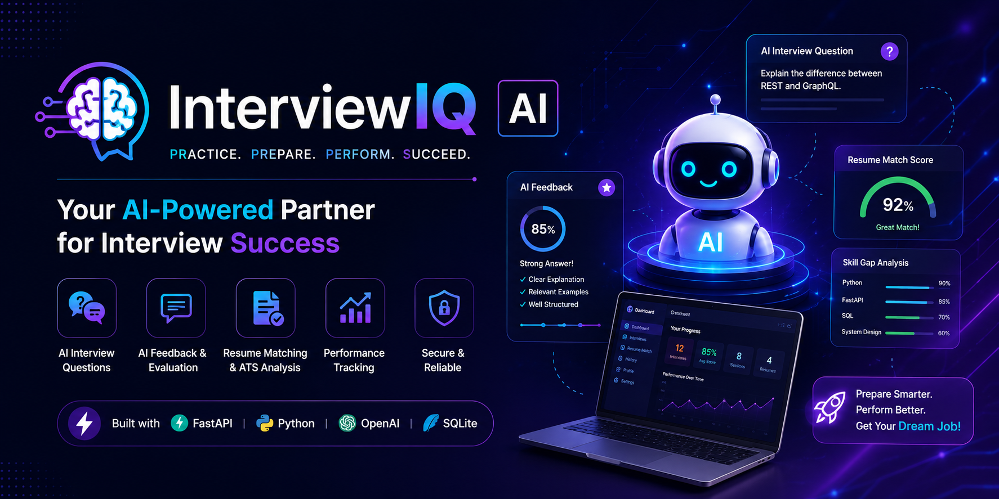
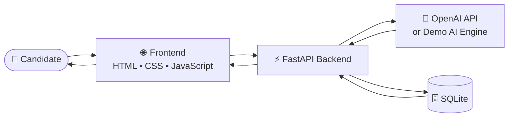
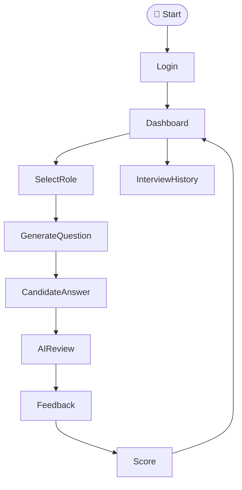
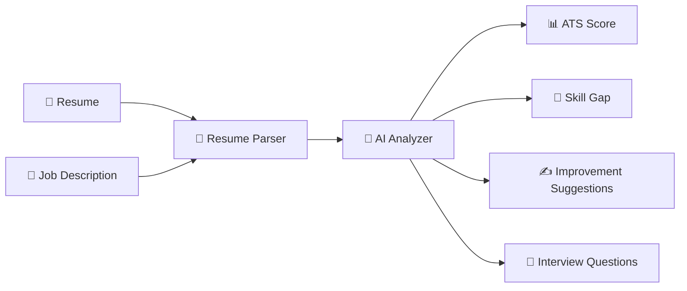

<!-- ======================== BANNER ======================== -->

<p align="center">  </p>
# 🧠 InterviewIQ AI

<p align="center">

<p align="center">

</p>

</p>

<p align="center">


</p>

<p align="center">

### 🎯 *Practice Smarter • Learn Faster • Get Hired*

</p>

---

# 🚀 Overview

**InterviewIQ AI** is a modern AI-powered interview preparation platform designed to help job seekers practice technical interviews, evaluate responses, improve resumes, and boost interview confidence.

Powered by **FastAPI**, **Python**, and the **OpenAI Responses API**, InterviewIQ AI simulates real interview experiences with intelligent feedback, resume-job matching, and personalized recommendations.

When no API key is available, the platform seamlessly switches to **Demo Mode**, ensuring every feature remains fully functional.

---

# ✨ Key Features

* 🤖 AI Interview Question Generator
* 💬 Intelligent Answer Evaluation
* 📄 Resume vs Job Description Matching
* 📊 ATS Compatibility Score
* 🧠 Skill Gap Analysis
* 📈 User Dashboard & Progress Tracking
* 🔐 Secure Authentication
* 💾 SQLite Database
* ⚡ Demo Mode (No API Key Required)
* 🌙 Clean & Responsive UI

---

# 🏗 System Architecture



---

# 🎯 Interview Workflow



---

# 📄 Resume Match Workflow



---

# 💻 Tech Stack

### Frontend

* HTML5
* CSS3
* JavaScript

### Backend

* FastAPI
* Python

### AI

* OpenAI Responses API
* Prompt Engineering
* AI Feedback Engine

### Database

* SQLite

---

# 📂 Project Structure

```text
InterviewIQ-AI/

├── backend/
│   ├── app/
│   │   ├── services/
│   │   ├── static/
│   │   ├── models.py
│   │   ├── main.py
│   │
│   ├── requirements.txt
│   ├── .env.example
│
├── README.md
```

---

# 🌟 Why InterviewIQ AI?

✅ Simulates real interview scenarios

✅ AI-powered resume evaluation

✅ Generates personalized interview questions

✅ ATS-style resume scoring

✅ Works with or without an OpenAI API key

✅ Built using production-ready FastAPI architecture

---

# 🚀 Future Roadmap

* 🎙 Voice-Based Interviews
* 🎥 Webcam Mock Interviews
* 📈 Performance Analytics
* 📄 AI Resume Builder
* 🌍 Multi-Language Support
* 📱 Mobile Application
* 🤖 AI Career Coach

---

<p align="center">

## ⭐ If you like this project, consider giving it a Star!

**Practice • Improve • Succeed 🚀**

</p>
